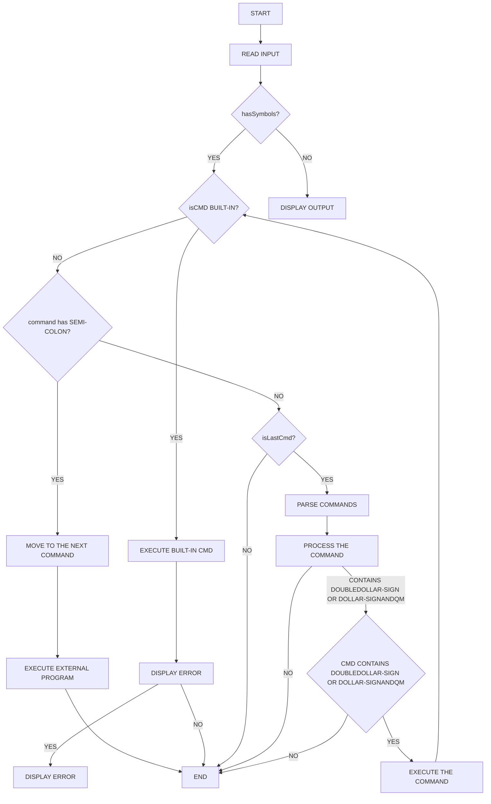
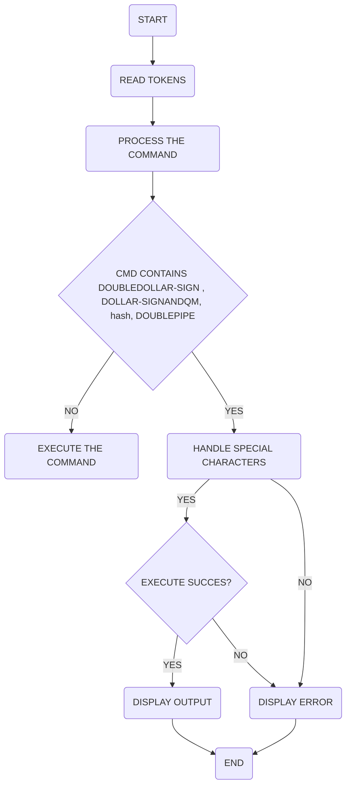

# Simple Shell

Welcome to the Simple Shell project! This shell is a basic implementation of a command-line interpreter, allowing you to execute commands in a Unix-like environment. This README provides an overview of the Simple Shell and includes a flowchart illustrating the command processing workflow.


## Features

- Execute built-in commands like `cd`, `exit`, and `help`.
- Launch external programs by providing their executable path.
- Handle multiple commands separated by a semicolon (`;`).
- Special characters like `$$`, `$?`, `#`, and `||` are supported for advanced command processing.
- Signal handling for process control (Ctrl-C).

## Flowchart



The flowchart outlines the steps involved in reading, parsing, and executing commands in the shell. It can serve as a visual reference for understanding the inner workings of the shell.

## Usage

To use the Simple Shell, follow these steps:
```sh
$ ls -l | grep my_file
$ echo "Hello, World!"
$ cd /path/to/directory
$ command1; command2
$ command1 && command2
$ command1 || command2
$ echo $VAR_NAME
$ echo #command
$ command1 || echo $?  # Check the exit status of command1
```
1. Clone the repository:

   ```bash
   git clone https://github.com/AbuArwa001/simple_Shell.git
   ```
1. Build the shell:

~~~
gcc -Wall -Werror -Wextra -pedantic *.c -o simple_shell
~~~

2. Run the shell:
```
./simple_shell
```
- You can now enter commands in the shell, and it will execute them accordingly.

## Example Usage
Here are some example commands you can try in the Simple Shell:

* Run an external program:

```
$ /bin/ls
```
* Change the current working directory:
~~~
$ cd /path/to/directory
~~~
* Use built-in help to display information about the shell:

~~~
$ help
~~~
* Execute multiple commands using ;:
~~~
$ ls -l ; pwd
~~~
For more information on the available features and usage, refer to the help built-in command within the shell.

## License
This project is distributed under the MIT License.

## Contributions
Contributions to this project are welcome. If you would like to enhance the Simple Shell or fix any issues, please create a pull request or open an issue on the GitHub repository.

We hope you find the Simple Shell useful and look forward to your feedback!